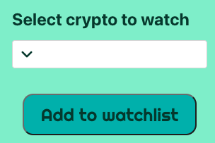
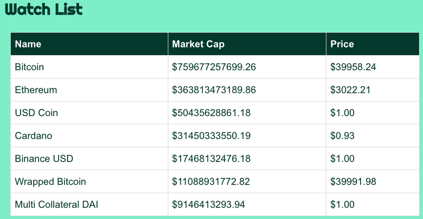
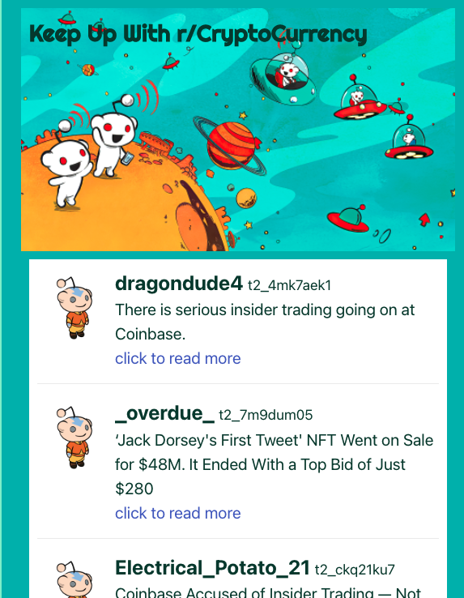
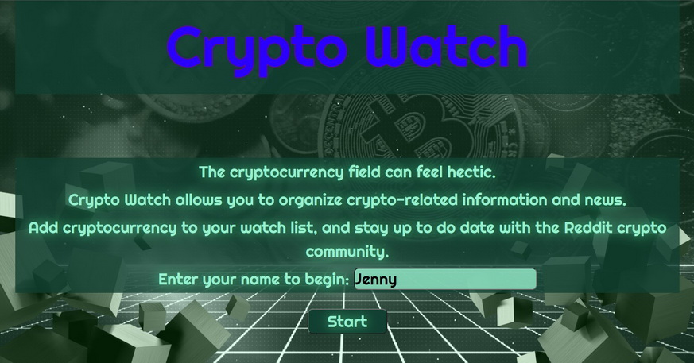
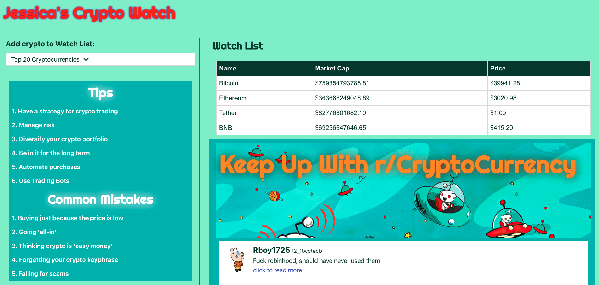

# Crypto Watch

## Overview
We created Crypto Watch! A new app where you can monitior your favorite Crypto currencies!\ 
We created a list of the 20 most popular currencies that you can be added to your personal watch list.

An API from CoinCap allows us to mainstream up-to-date information about cryptocurrency.\
From the watch list  you can monitor key infromation in real time. 
From Bitcoin, to DogeCoin, to Polkadot, you can monitior them all from Crypto Watch.

Additionally, Reddit's API made it possible to included a section to see what people are talking about on the subreddit r/CryptoCurrency.

## Sources
We worked around the clock using HTML, CSS and JavaScript to create a super cool and unique crypto monitoring website that can be used on any device.\
Local storage ensures that your watch list is stored for viewing at later times, and the API calls that are made ensure that the information provided is the most relevant and current information available.

## Website 
checkout the website from the link bellow!
https://brichardson117.github.io/Crypto-Watch/ 

Thank you!

Creators Doug, Jessica, and Brittney ❤️
